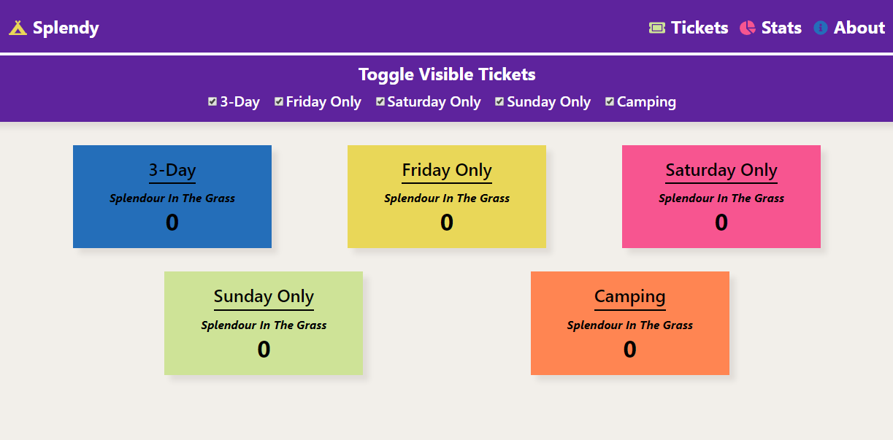

# Splendy - *Splendour In The Grass Ticket Tracker*

## [Live Demo](https://splendy.ramtek.dev)

#### Splendy, is a [Splendour In The Grass](https://splendourinthegrass.com/) ticket tracker so you can be notified when tickets become available on their offical resale site. You can subscribe to certain types of tickets and the app will send you a notification when one becomes available.

#### This project is fully open source so if you would like to host your own version follow the steps listed below

1. #### First you will need a copy of the react web app hosted here.
    ### [Splendy Web](https://github.com/Riley-March/Splendy-web)
2. #### Install the required dependencies with a yarn or npm install
3. #### Run the development server using yarn start or npm start